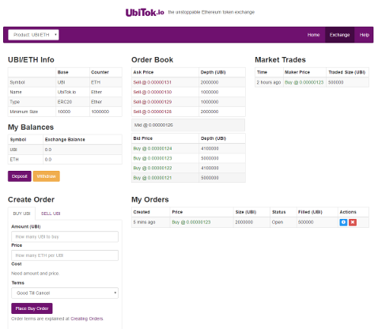

# UbiTok.io
an unstoppable exchange for trading Ethereum tokens

UbiTok.io runs entirely on the blockchain, which for clients means:
- no limits, no sign-up, no waiting for support to verify you;
- it cannot be shutdown by regulators - or even by its creators;
- you don't need to trust the exchange employees to look after your coins;
- ultra-low exchange fees (plus a little gas to power the Ethereum blockchain);
- total fairness: no preferential treatment for "special" clients.

We aim to be the leading venue for trading Ethereum assets on-chain, and to help grow an ecosystem of smart contracts trading with each other (and with you).

## See UbiTok.io in Action
Beta release coming soon ...

## What can I trade on UbiTok.io?
Almost anything based on Ethereum (such as ERC20 tokens) can be traded on UbiTok.io, either against Ethereum or against other tokens.

This includes coins/tokens connected to organisations in various industries such as:
- DICE - gambling;
- REP (Augur), GNO (Gnosis) - prediction markets;
- BAT - advertising;
- MYST - networking

As well as tokens backed by assets, including:
- DGD - physical gold;
- Decentralized Capital (DC) - Bitcoin, USD, EUR assets;
- BNT (Bancor), VERI - smart reserves

## How does UbiTok.io compare to other decentralized exchanges?
As far as we know, UbiTok.io is the first decentralized exchange to meet the following three tests:
 - our clients don't need to install any special P2P software;
 - we don't use an off-chain matching engine so we have no servers to shut down or be hacked;
 - we offer a [full limit order book](./docs/trading-rules.md), giving clients the best possible price and the exchange features you expect.

## Who's behind UbiTok.io?
Our founder and principal technologist has a background in algorithmic trading systems. He previously spent over a decade building secure, high volume gambling sites for leading bookmakers. He first dabbled in bitcoin in 2013 before flipping to Ethereum in 2015.

We're interested in growing our team in the near future - contact opportunities@ubitok.io.

## Are there downsides to being 100% on-chain?
Yes - transaction times are much slower than a centralised exchange. This is hard to avoid - we need 1000s of Ethereum nodes worldwide to agree on the state of the orderbook (without trusting each other). You won't find High Frequency Traders on UbiTok.io - not necessarily a bad thing for everyone else! We've also had to reduce the number of price levels offered to allow us to perform best execution on-chain - so you'll see prices like 1.23, not 1.2298502.

## OK, but how do I withdraw cash from your exchange?
We're not planning to interface with the traditional banking system, so if you need cash in your bank account, you'll need to use a third-party to turn your Ethereum or Ethereum tokens into cash in a bank account. We are considering entering into a partnership to make this easier.

Over time, we're confident that withdrawing to cash in a bank account will become less necessary for many clients as:
 - More coins and tokens are built on top of Ethereum, so transactions stay on-chain;
 - More companies like [Decentralized Capital](https://www.decentralizedcapital.com/) (no connection or endorsement) offer stable Ethereum tokens backed by fiat currency, so you can (effectively) hold fiat currency on-chain;
 - More merchants accept payments in Ethereum or Ethereum-based tokens.

## What are your fees? How do UbiTok.io make money?
Because we're not dealing with banks, or user sign-ups, or hosting providers, we have much lower costs than traditional exchanges.

We guarantee to:
 - never charge any fees (0%) for depositing or withdrawing Ethereum, or Ethereum-based tokens;
 - never charge any trading fees (0%) for orders that add liquidity to the exchange (that is, orders that rest on the book);
 - never charge a trading fee of more than 0.05% for orders that take liquidity from the exchange (that is, orders that match against an order on the book)

In order to avoid relying on trading fees, we hope to offer value-added products and services that build on top of our core exchange - see roadmap below.

## What's on the UbiTok.io roadmap?
- Alpha testnet (play-money) release (Jul/Aug 2017);
- Main-net (real-money) release offering small number of pairs, MetaMask/Mist only (Sep/Oct 2017);
- Work in any browser without needing MetaMask or Mist installed (Oct 2017);
- Developer tools and APIs for creating smart contracts and JS apps that trade via UbiTok.io - e.g. for market making, maintaining a pool of reserves, running ICOs (2017Q4);
- Improved user interface and price charts (2017Q4);
- Margin trading / lending market-place (tbc);
- Consider offering our own asset backed tokens where it makes sense (tbc);
- Host UbiTok.io front-end in Swarm/IPFS for total unstoppability (tbc);
- Derivative contracts - e.g. futures, options (tbc)

Perhaps you have some ideas for smart tokens that can be traded on our exchange, or for autonomous smart contracts that place orders into the exchange - we look forward to seeing what can be done with a fully on-chain trading venue.

## Are you planning a crowd-sale?
We are considering a crowd-sale to allow us to invest in marketing, better UI design, client support - and most importantly to accelerate our product development.

We want to make sure we have a working product and a solid business model first though.

Email fundraising@ubitok.io if you'd like to hear about early investment opportunities.

## Give me some technical details!
Take a look at our main smart contract here: [BookERC20EthV1.sol](https://github.com/kieranelby/UbiTok.io/blob/master/contracts/BookERC20EthV1.sol).

We're going to publish full details of how our contracts work as soon as we've reached our alpha release.

In the meantime, here's the original sketch showing the key technique (we call it "price packing") that allows efficient on-chain best execution matching:

## I have a question not listed here!
Contact us at help@ubitok.io.
